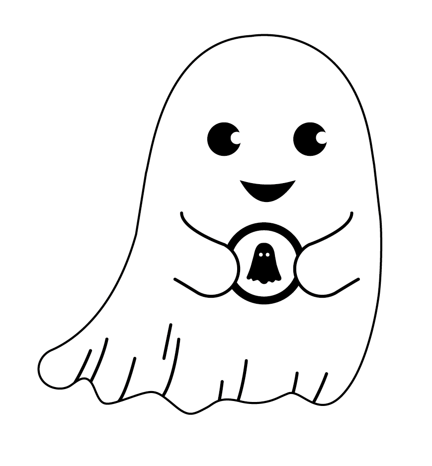

# **FantomGames**

# :bookmark: Présentation

Nous avons pour objectif de développer une application internet permettant de centraliser de nombreux jeux en créant des classements communs et une monnaie commune interne. Celle-ci prendra la forme d’une crypto-monnaie collectable uniquement depuis notre plateforme. Il devra être accessible facilement au plus grand nombre tout en restant compétitif. Nous pourrons alors ajouter des jeux par la suite pour agrandir les possibilités du site. Nous avons pour but d’apporter à nos utilisateurs de la compétition entre eux, mais aussi de l’amusement.

# Organisation

Nous avons mis en place des outils de communication et de rapport de l’activité au sein de différentes plateformes. Discord pour les fichiers et les sondages, message pour la communication rapide et CodeFirst pour noter notre temps de travail.

# Conception 

# :construction: Développeurs

- Dorian HODIN : dorian.hodin@etu.uca.fr

